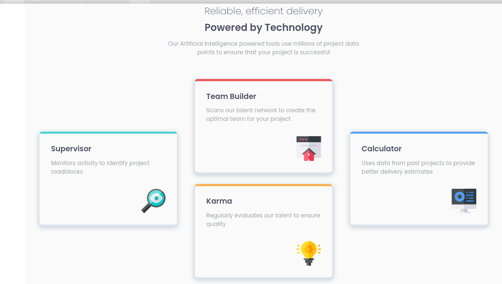
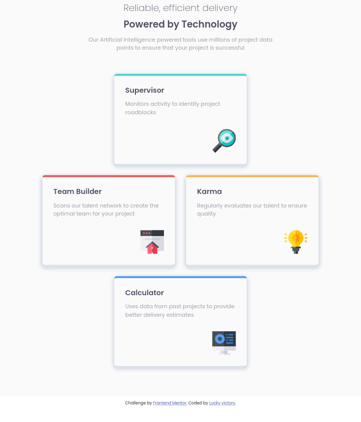
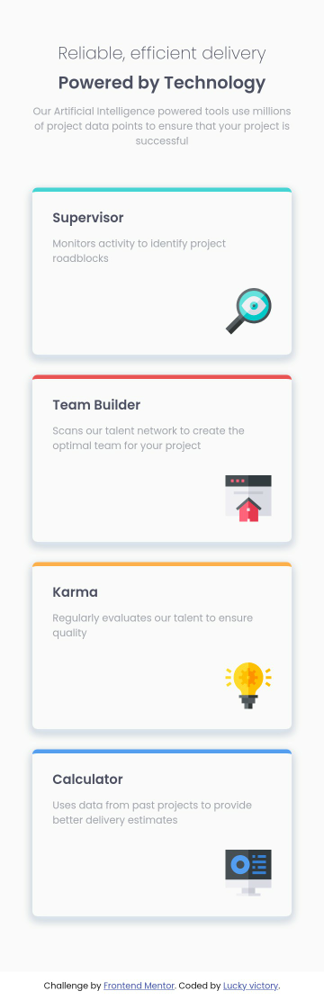

# Frontend Mentor - Four card feature section solution

This is a solution to the [Four card feature section challenge on Frontend Mentor](https://www.frontendmentor.io/challenges/four-card-feature-section-weK1eFYK). Frontend Mentor challenges help you improve your coding skills by building realistic projects. 

## Table of contents

- [Overview](#overview)
  - [The challenge](#the-challenge)
  - [Screenshot](#screenshot)
  - [Links](#links)
- [My process](#my-process)
  - [Built with](#built-with)
  - [What I learned](#what-i-learned)
  - [Continued development](#continued-development)
  
- [Author](#author);

**Note: Delete this note and update the table of contents based on what sections you keep.**

## Overview

### The challenge

Users should be able to:

- View the optimal layout for the site depending on their device's screen size

### Screenshot
**Desktop View Screenshot**


**Tablet View Screenshot**



**Mobile View Screenshot**



### Links

- Solution URL: [four card feature section](https://github.com/lucky-victory/FEM/four-card-feature-section-master/)
- Live Site URL: [four card feature section](https://lucky-victory.github.io/FEM/four-card-feature-section-master/)

## My process

### Built with

- Semantic HTML5 markup
- Flexbox
- Mobile-first workflow

### What I learned

i learnt how to use CSS flexbox to position elements in a grid-like pattern.


```html
<div class="cards-container-inner"> this div is my favourite because it did the layout trick.
</div>
```


### Continued development

Positioning the middle cards was the toughest part of this challenge, i would focus more on being about recreate similar layouts using CSS Flexbox.


## Author

- Website - [Lucky-victory.dev](https://lucky-victory.dev)
- Frontend Mentor - [@luckyvictory](https://www.frontendmentor.io/profile/lucky-victory)
- Twitter - [@lucky_victory1](https://www.twitter.com/lucky_victory1)
- LinkedIn - [Lucky victory success](https://www.linkedin.com/in/lucky-victory-success-42719b1a5)


